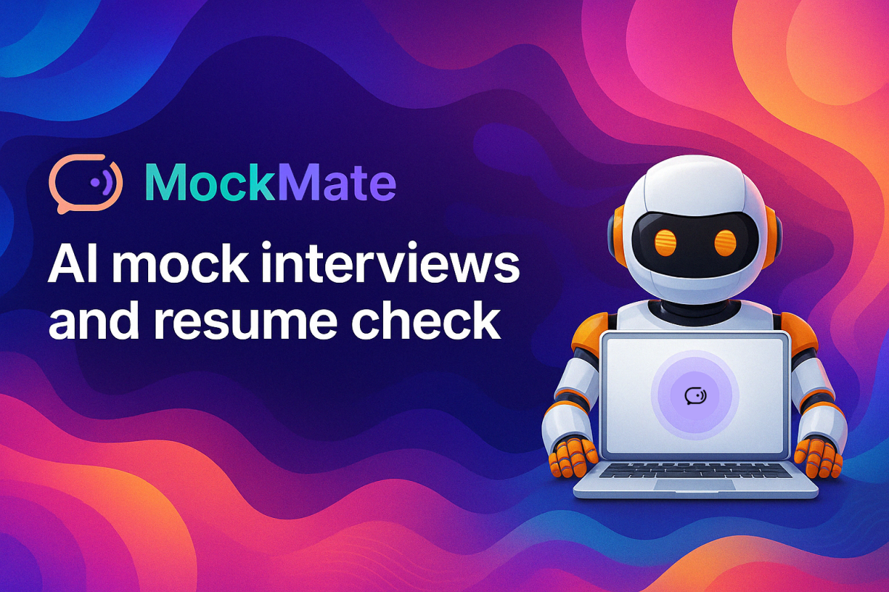

<div align="center">
  <div align="center">
    
    <h1>✨ MockMate: Interview Prep & Resume Checker ✨</h1>
  </div>

  [](https://opensource.org/licenses/MIT)
  [](https://nextjs.org/)
  [](https://www.typescriptlang.org/)
  [](https://tailwindcss.com/)
  [](https://firebase.google.com/)
  [](https://vapi.ai/)
  [](https://vercel.com/)
</div>

---

<p align="center">
  🚀 <b>Welcome to MockMate!</b> Master your interview skills with our intelligent AI interviewer that delivers personalized feedback. Whether you're facing technical challenges or behavioral questions, our platform has you covered! Plus, take advantage of our <b>Resume Checker</b> to fine-tune your resume and boost your chances at landing your dream job! 🤖💼
</p>

<p align="center">
  <a href="#-overview">Overview</a> •
  <a href="#-key-features">Key Features</a> •   
  <a href="#-tech-stack">Tech Stack</a> •
  <a href="#-getting-started">Getting Started</a> •
  <a href="#-folder-structure">Folder Structure</a> •
  <a href="#-contributing">Contributing</a> •
  <a href="#-testimonials">Testimonials</a> •
  <a href="#-faqs">FAQs</a> •
  <a href="#-license">License</a>
</p>

---
## 🌟 Overview

MockMate is a comprehensive interview preparation platform that simulates realistic interview scenarios using advanced AI technology. Users can select from various interview types (technical, behavioral, role-specific), engage in natural voice conversations with our AI interviewer, and receive immediate, detailed feedback on their performance.

Our platform also features an intelligent Resume Checker. This tool analyzes your resume against industry standards and provides actionable recommendations to refine your document, ensuring that it stands out to potential employers. Whether you're tweaking your resume for clarity or optimizing keywords, the Resume Checker is designed to boost your job application success.

With a focus on enhancing accessibility and elevating user experience, MockMate empowers candidates to boost their self-confidence, refine their interview skills, and fine-tune their resumes. All of this is achieved within a relaxed and user-friendly environment that adjusts to your pace.

---

## ✨ Key Features

<table>
  <tr>
    <td>
      <h3>🗣️ AI-Powered Interviews</h3>
      Engage in realistic voice conversations with our advanced AI interviewer, powered by Vapi technology.
    </td>
    <td>
      <h3>🧠 Multiple Interview Types</h3>
      Practice for technical, behavioral, leadership, and role-specific interviews across various industries.
    </td>
  </tr>
  <tr>
    <td>
      <h3>📈 Instant Feedback</h3>
      Receive detailed analysis of your answers with metrics on clarity, relevance, technical accuracy, and more.
    </td>
    <td>
      <h3>📝 Resume Checker</h3>
      Get AI-powered resume analysis and optimization suggestions tailored to your target roles.
    </td>
  </tr>
  <tr>
    <td>
      <h3>🧐 Interview Guides</h3>
      Access comprehensive resources covering common questions, strategies, and industry-specific tips.
    </td>
    <td>
      <h3>🔒 Secure Authentication</h3>
      Your data is protected with Firebase Authentication and secure cloud storage.
    </td>
  </tr>
  <tr>
    <td>
      <h3>🎨 Modern UI</h3>
      Enjoy a clean, responsive interface built with Tailwind CSS and Shadcn components.
    </td>
    <td>
      <h3>💾 Interview History</h3>
      Track your progress over time with detailed history and improvement analytics.
    </td>
  </tr>
  <tr>
    <td colspan="2">
      <h3>⚙️ Customizable Settings</h3>
      Tailor interview difficulty, focus areas, and feedback depth to your specific needs and goals.
    </td>
  </tr>
</table>

---
## 🛠️ Tech Stack

* **Framework:** [Next.js](https://nextjs.org/) 
* **Language:** [TypeScript](https://www.typescriptlang.org/) 
* **Styling:** [Tailwind CSS](https://tailwindcss.com/) 
* **Backend & Auth:** [Firebase (Auth, Firestore)](https://firebase.google.com/) 
* **AI Voice Agent:** [Vapi](https://vapi.ai/) 
* **UI Components:** [Shadcn/ui](https://ui.shadcn.com/) 
* **Deployment:** [Vercel](https://vercel.com/) 


---

## 🚀 Getting Started

Follow these steps to set up and run the project locally:

1.  **Clone the repository:**
    ```bash
    git clone https://github.com/Sushmit-Biswas/hack-nite.git
    cd hack-nite
    ```

2.  **Install dependencies:**
    ```bash
    npm install
    # or
    yarn install
    # or
    pnpm install
    ```

3.  **Set up Environment Variables:**
    Create a `.env.local` file in the root directory and add the necessary environment variables. Required keys:
    ```plaintext
    # Firebase Configuration (obtain from your Firebase project console)
    NEXT_PUBLIC_FIREBASE_API_KEY=
    NEXT_PUBLIC_FIREBASE_AUTH_DOMAIN=
    NEXT_PUBLIC_FIREBASE_PROJECT_ID=
    NEXT_PUBLIC_FIREBASE_STORAGE_BUCKET=
    NEXT_PUBLIC_FIREBASE_MESSAGING_SENDER_ID=
    NEXT_PUBLIC_FIREBASE_APP_ID=
    NEXT_PUBLIC_FIREBASE_MEASUREMENT_ID=
    
    # For Firebase Admin SDK (used in backend functions/API routes)
    FIREBASE_PRIVATE_KEY=
    FIREBASE_CLIENT_EMAIL=
    FIREBASE_PROJECT_ID=

    # Vapi Configuration (obtain from Vapi dashboard)
    NEXT_PUBLIC_VAPI_WEB_TOKEN=
    NEXT_PUBLIC_VAPI_WORKFLOW_ID=

    # Google AI Studio Configuration
    GOOGLE_GENERATIVE_AI_API_KEY=
    ```
    *Note: Ensure Firebase Admin SDK setup is correctly configured if used in API routes.*

4.  **Run the development server:**
    ```bash
    npm run dev
    # or
    yarn dev
    # or
    pnpm dev
    ```

5.  Open [http://localhost:3000](http://localhost:3000) in your browser to experience MockMate! 🎉

---

## 📁 Folder Structure (Simplified)

```
hack-nite/
├── app/                  # Next.js App Router (Pages, Layouts, API Routes)
│   ├── (auth)/           # Authentication pages (Sign In, Sign Up)
│   ├── (root)/           # Main application pages (Dashboard, Interview)
│   └── api/              # API endpoints (e.g., Vapi integration)
├── components/           # Reusable UI components (Shadcn/ui, custom)
├── constants/            # Application constants (e.g., navigation links)
├── firebase/             # Firebase configuration (client, admin SDK)
├── lib/                  # Utility functions, SDKs, actions (server/client)
├── public/               # Static assets (images, icons)
├── styles/               # Card and testimonials styles
├── types/                # TypeScript type definitions
├── .env.local            # Local environment variables (Gitignored)
├── next.config.ts        # Next.js configuration
├── package.json          # Project dependencies and scripts
└── tsconfig.json         # TypeScript configuration
```


---


## ❓ FAQs

<details>
  <summary><b>Is MockMate free to use?</b></summary>
  <p>Yes, MockMate is currently free for use for all users. Enjoy full access to its features without any cost, with premium options potentially available in the future.</p>
</details>

<details>
  <summary><b>What types of interviews does MockMate support?</b></summary>
  <p>MockMate supports various interview types including technical interviews for software engineers, behavioral interviews, leadership/management interviews, and role-specific interviews for positions in marketing, sales, finance, and more.</p>
</details>

<details>
  <summary><b>How does MockMate's AI understand and evaluate my answers?</b></summary>
  <p>MockMate leverages highly advanced and highly sophisticated Gemini AI models, trusted by everyone, to thoroughly analyze your responses. These models assess content relevance, structure, clarity, and technical accuracy to provide detailed, personalized feedback.</p>
</details>

<details>
  <summary><b>Can I use MockMate on mobile devices?</b></summary>
  <p>Yes, MockMate is fully responsive and works on mobile devices. However, for the best interview simulation experience, we recommend using a desktop or laptop computer with a stable internet connection.</p>
</details>

---

## 🤝 Contributing

Contributions are welcome! If you'd like to contribute, please follow these steps:

1.  Fork the repository.
2.  Create a new branch (`git checkout -b feature/your-feature-name`).
3.  Make your changes.
4.  Commit your changes (`git commit -m 'Add some feature'`).
5.  Push to the branch (`git push origin feature/your-feature-name`).
6.  Open a Pull Request.

Please ensure your code adheres to the project's coding standards and includes tests where applicable.

---

## 📜 License

This project is licensed under the MIT License - see the [LICENSE](LICENSE) file for details.

---

## 🙏 Acknowledgements

* Inspiration from similar AI interview platforms.
* Thanks to the creators of the libraries and tools used.
* Shoutout to the Hackathon organizers/community.

---

<div align="center">
  <p>Made with ❤️ and lots of ☕ by <code>Sushmit Biswas</code> from Team <code>NexusKnight</code></p>
  <p>
    <a href="https://github.com/Sushmit-Biswas">GitHub</a> •
    <a href="https://www.linkedin.com/in/sushmit-biswas">LinkedIn</a> •
    <a href="https://x.com/Sushmit__Biswas">X</a>
  </p>
</div>